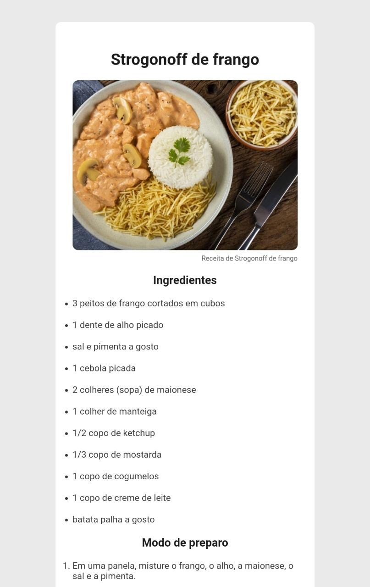

<h1 align="center">
    <br>Desafio: Página de Receita<br/>
     HTML5 | CSS3
</h1>
<h2>
</h2>
<p align="center">
  <a href="#bookmark-sobre">Sobre</a>&nbsp;&nbsp;&nbsp;|&nbsp;&nbsp;&nbsp;
  <a href="#rocket-tecnologias">Tecnologias</a>&nbsp;&nbsp;&nbsp;|&nbsp;&nbsp;&nbsp;
  <a href="#boom-como-executar">Como Executar</a>&nbsp;&nbsp;&nbsp;|&nbsp;&nbsp;&nbsp;
  <a href="#memo-licença">Licença</a>
</p>
<p align="center">
  <a target="_blank" href="https://pagina-de-receita-two.vercel.app/">
    
  </a>
</p>
<p align="center">
<br>
  
<p>

## :bookmark: Sobre

O **Desafio: Página de Receita** é uma aplicação Web e Mobile feito com objetivo de praticar criação de página web de uma receita com título, imagem, lista de ingredientes e modo de preparo. Logo, esta aplicação oferece aos alunos a visão de como estruturar um site HTML do absoluto zero, usando o HTML5 semântico e CSS3 responsivo tornando o site acessível a qualquer dispositos móveis.
  
Este desafio foi idealizado por <a href="https://app.rocketseat.com.br/discover" >Discover da Rocketseat.<a/>

## :rocket: Tecnologias

-  [HTML5](https://developer.mozilla.org/pt-BR/docs/Web/HTML)
-  [CSS3](https://developer.mozilla.org/pt-BR/docs/Web/CSS)

## :boom: Como Executar

- ### **Pré-requisitos**

  - É **necessário** possuir o **[Git](https://git-scm.com/)** instalado e configurado no computador

1. Faça um clone do repositório:

```sh
  $ git clone https://github.com/LuisRobertoAntunes/Pagina-de-receita.git
```

## :memo: Licença

Esse projeto está sob a licença MIT. Veja o arquivo [LICENSE](LICENSE.md) para mais detalhes.

---
